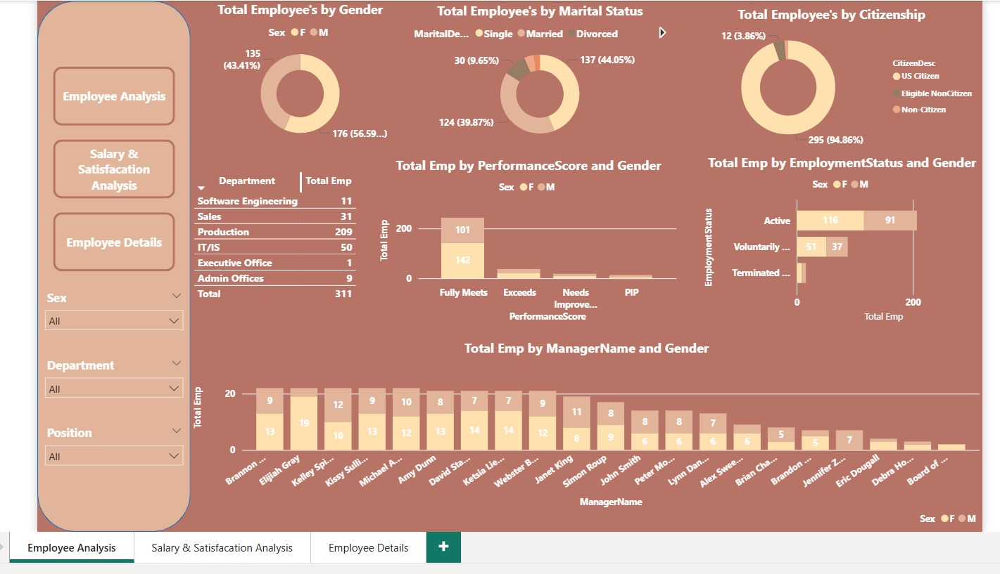
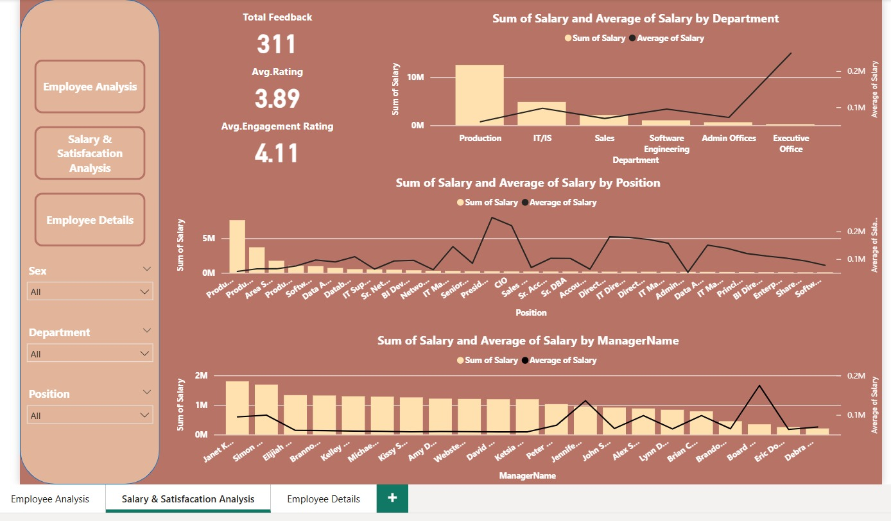
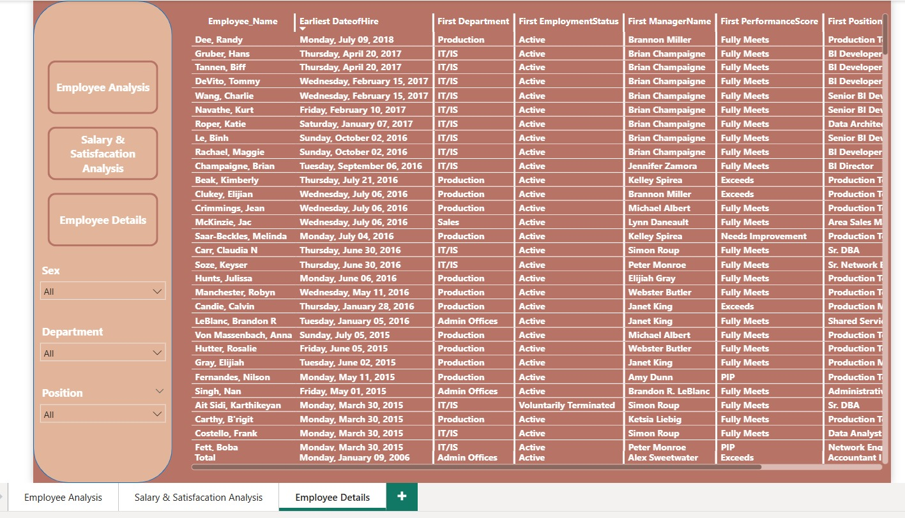

## 📘 Project Overview

This project is a comprehensive Human Resources (HR) Analytics dashboard built using **Power BI**. The objective is to transform raw HR data into actionable insights, providing management with a clear view of employee demographics, performance, and satisfaction levels to support strategic HR decisions.

## 🔑 Key Features & Dashboard Pages

The dashboard is structured into three dedicated pages using **Page Navigation** for seamless user experience:

1.  **Employee Analysis:** Focuses on employee demographics and status:
    * Total Employee Count (KPI).
    * Distribution by Gender, Marital Status, and Citizenship.
    * Analysis of **Performance Score** distribution (Fully Meets, Exceeds, etc.).
    * Total Employees by Employment Status (Active vs. Terminated).

2.  **Salary & Satisfaction Analysis:** Correlates employee compensation with feedback:
    * KPIs: Total Feedback, Average Rating, and Average Engagement Rating.
    * Analysis of **Total Salary and Average Salary** across Departments and Positions.
    * Insights on compensation structures by Manager.

3.  **Employee Details:** A detailed, sortable table view of individual employee data.

## ⚙️ Tools & Techniques Used

* **Primary Tool:** Microsoft Power BI Desktop
* **DAX Measures:** Used simple calculated measures (مثل: **Total Employees**) to create key performance indicators (KPIs).
* **Visualization & UX:** Utilized various chart types (Doughnut, Bar charts) and implemented **Page Navigation** for smooth reporting flow.

## 📈 Value & Key Insights

This dashboard enables the HR department to quickly answer critical questions, such as:

* Which departments have the highest or lowest performance scores?
* How do salary levels correlate with employee satisfaction and engagement ratings?
* What is the current distribution of active vs. terminated employees across the organization?

---
## 🖼️ Dashboard Snapshots (لقطات الشاشة)

للاطلاع على التقرير بشكل مرئي:

### 1. Employee Overview

### 2. Salary & Satisfaction Analysis

### 3. Employee Details

